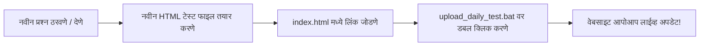

# 📖 Success Digital — Project Workflow & Agent Support Guide

> **प्रकल्प नाव (Project Name):** Success Digital - Maha TET & CET Daily Test Series  
> **अधिकृत वेबसाइट (Live URL):** [https://successdigitaloffice-cell.github.io/success-digital-tests/](https://successdigitaloffice-cell.github.io/success-digital-tests/)  
> **गिटहब रिपॉझिटरी (GitHub Repo):** [https://github.com/successdigitaloffice-cell/success-digital-tests](https://github.com/successdigitaloffice-cell/success-digital-tests)  
> **ॲप लिंक (Official App):** [Success Digital Android App](https://play.google.com/store/apps/details?id=com.ezgcka.oujtga&pcampaignid=web_share)

---

## 📌 १. आत्तापर्यंत काय पूर्ण झाले आहे? (What Has Been Done)

| # | घटक (Component) | स्थिती (Status) | तपशील (Details) |
|---|---|---|---|
| 1 | **Central Test Portal** (`index.html`) | ✅ पूर्ण (Live) | मुख्य लँडिंग पेज. ४ श्रेण्यांमधील संपूर्ण ८० चाचण्यांची सूची, लाईव्ह सर्च बार, फिल्टर टॅब्स, मोबाइल ॲप इन्स्टॉल बॅनर. |
| 2 | **Maha TET Paper 1 Series** (Tests 1 to 20) | ✅ पूर्ण (Live) | प्राथमिक शिक्षक पात्रता परीक्षेसाठी २० संपूर्ण चाचण्या (पियाजे, वायगोत्स्की, RTE, NEP, मराठी व्याकरण, गणित, EVS). |
| 3 | **Maha TET Paper 2 Series** (Tests 1 to 20) | ✅ पूर्ण (Live) | उच्च प्राथमिक परीक्षेसाठी २० संपूर्ण चाचण्या (किशोरावस्था, अलंकार, वृत्त, गणित, विज्ञान - Physics, Chem, Bio व समाजशास्त्र). |
| 4 | **CTET Paper 1 Series** (Tests 1 to 20) | ✅ पूर्ण (Live) | NCERT पॅटर्ननुसार २० संपूर्ण केंद्रीय चाचण्या (Van Hiele, Kuduk, Pochampally, EVS Themes, Chomsky LAD, Krashen). |
| 5 | **CTET Paper 2 Series** (Tests 1 to 20) | ✅ पूर्ण (Live) | इयत्ता ६ ते ८ NCERT पॅटर्ननुसार २० संपूर्ण केंद्रीय चाचण्या (Formal Operations, Metacognition, Science & Social Pedagogy). |
| 6 | **Universal Test Player** (`test.html`) | ✅ पूर्ण (Live) | डायनॅमिक थीमिंग, टायमर, रिअल-टाइम स्पष्टीकरण, ॲप प्रमोशन बॅनर, अचूक रँक अंदाज व व्हॉट्सॲप शेअरिंग. |
| 7 | **Central Question Bank** (`data/tests_data.js`) | ✅ पूर्ण (Live) | ८० चाचण्यांचा गैर-पुनरावृत्ती, १००% अभ्यासक्रम-संरेखित आणि स्पष्टीकरणात्मक समृद्ध प्रश्नसंग्रह (२१२ KB). |
| 8 | **GitHub Repository & Pages** | ✅ पूर्ण (Live) | `successdigitaloffice-cell/success-digital-tests` वर सर्व ८० चाचण्या लाईव्ह तैनात. |
| 9 | **1-Click Sync Automation** (`upload_daily_test.bat`) | ✅ पूर्ण | भविष्यात बदल किंवा नवीन प्रश्न १-क्लिकवर गिटहबवर सिंक करण्यासाठी पॉवरशेल ऑटोमेशन. |

---

## 🎯 २. महत्वाचे नियम व गुणवत्ता मानके (Rules & Quality Standards)
1. **कोणत्याही चाचणीत किंवा पोर्टलवर कोणत्याही आगामी वर्षाचा उल्लेख नाही** (Strictly No future year mentions).
2. **प्रश्नांची पुनरावृत्ती नाही** (Zero duplicate questions).
3. **१००% अभ्यासक्रम अचूकता** (100% syllabus alignment across CDP, Languages, Maths, Science, Social Studies).
4. **Success Digital Android App चा सतत व योग्य प्रचार** (Google Play Store link: `https://play.google.com/store/apps/details?id=com.ezgcka.oujtga&pcampaignid=web_share`).

---

## 🛠️ ३. दररोज नवीन टेस्ट कशी ॲड करावी? (Daily Test Workflow)

तुम्हाला किंवा या AI एजंटला नवीन टेस्ट तयार करणे अतिशय सोपे आहे:



### चरण १: नवीन टेस्ट फाइल तयार करणे
- मागील टेस्ट कॉपी करून नाव द्या: `success_digital_tet_paper_1_test_03.html`
- त्यातील `quizData` मधील २० प्रश्न, पर्याय, अचूक उत्तर आणि मराठी स्पष्टीकरण बदला.

### चरण २: मुख्य पोर्टल (`index.html`) अपडेट करणे
- `index.html` उघडा आणि `<!-- Test 02 Card -->` च्या खाली नवीन टेस्ट कार्ड पेस्ट करा:
```html
<!-- Test 03 Card -->
<div class="bg-white rounded-2xl p-5 md:p-6 border border-slate-200 shadow-sm card-hover flex flex-col md:flex-row md:items-center justify-between gap-4">
    <div class="flex items-start gap-4">
        <div class="w-12 h-12 rounded-xl bg-purple-100 text-purple-700 flex items-center justify-center font-black text-lg shrink-0">
            03
        </div>
        <div>
            <span class="bg-green-100 text-green-700 text-[11px] font-bold px-2.5 py-0.5 rounded-full">TET Paper 1</span>
            <h4 class="text-lg md:text-xl font-bold text-slate-800">TET Paper 1 - दैनिक सराव टेस्ट 03</h4>
            <p class="text-xs md:text-sm text-slate-500 mt-1">थॉर्नडाईक, स्किनर, समास, Prepositions, लसावि-मसावि, भूगोल</p>
        </div>
    </div>
    <a href="success_digital_tet_paper_1_test_03.html" class="bg-blue-600 hover:bg-blue-700 text-white font-bold px-6 py-3 rounded-xl transition">
        टेस्ट सुरू करा <i class="fas fa-play text-xs ml-1"></i>
    </a>
</div>
```

### चरण ३: १-क्लिक सिंक (GitHub Upload)
- फोल्डरमधील **`upload_daily_test.bat`** वर फक्त डबल-क्लिक (Double Click) करा.
- स्क्रिप्ट सर्व फाइल्स गिटहबवर पाठवेल आणि १ मिनिटात टेस्ट विद्यार्थ्यांसाठी लाईव्ह होईल!

---

## 🤖 ४. या AI एजंटकडून काम करून घेण्याचे मार्ग (How to Prompt This Agent)

जेव्हाही तुम्हाला पुढील काम करायचे असेल, तेव्हा फक्त खालीलप्रमाणे सांगा:

1. **नवीन टेस्ट तयार करण्यासाठी:**  
   > *"Maha TET Paper 1 ची Test number 03 तयार कर आणि index.html मध्ये ॲड करून गिटहबवर पुश कर."*

2. **विशिष्ट विषयाची टेस्ट बनवण्यासाठी:**  
   > *"फक्त बालमानसशास्त्र (CDP) विषयावर आधारित २० प्रश्नांची Special Mock Test तयार कर."*

3. **नवीन प्रश्न किंवा उत्तरपत्रिका पुरवून टेस्ट बनवण्यासाठी:**  
   > *"माझ्याकडे हे २० प्रश्न आहेत (प्रश्न पेस्ट करा), यांची नवीन टेस्ट तयार करून पोर्टलवर जोडा."*

4. **डिझाइन किंवा फिचर्स बदलण्यासाठी:**  
   > *"टेस्ट सोडवल्यानंतर विद्यार्थ्याला PDF डाऊनलोड करण्याचे बटण किंवा WhatsApp ग्रुप जॉईन करण्याचे बटण जोडा."*

---

## 📂 ५. फोल्डरमधील फाइल्सची रचना (File Structure)

```
c:\Users\user\Downloads\sucess\
│
├── index.html                                  <- मुख्य दैनिक टेस्ट पोर्टल (Home Page)
├── success_digital_tet_paper_1_test_01.html    <- टेस्ट नंबर ०१
├── success_digital_tet_paper_1_test_02.html    <- टेस्ट नंबर ०२
│
├── upload_daily_test.bat                       <- १-क्लिक गिटहब अपलोडर (Windows Batch)
├── upload_daily_test.ps1                       <- ऑटोमॅटिक पॉवरशेल सिंक स्क्रिप्ट
├── github info.txt                             <- क्रेडेंशियल्स आणि सर्व लाईव्ह लिंक्स
├── README.md                                   <- गिटहब रिपो माहिती
└── PROJECT_WORKFLOW_AND_AGENT_GUIDE.md         <- ही सविस्तर मार्गदर्शक फाइल
```

---
*Success Digital - विद्यार्थ्यांच्या उज्ज्वल भविष्यासाठी डिजिटल व्यासपीठ!*
